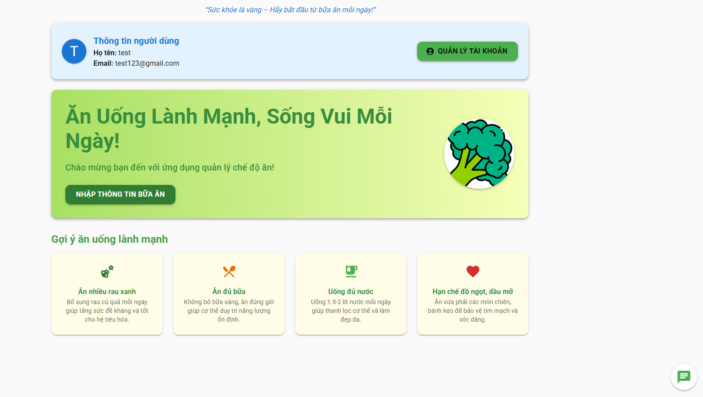
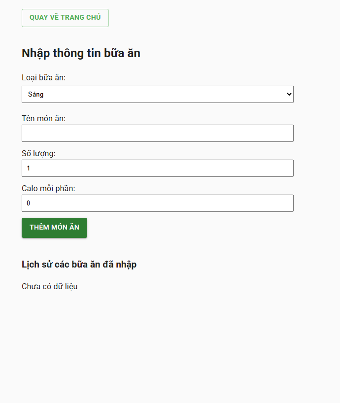
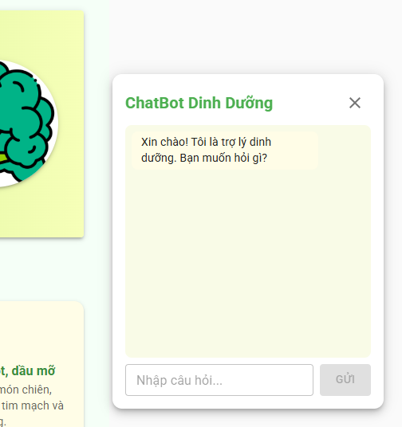

# 🥦 Ứng Dụng Quản Lý Chế Độ Ăn

**Thành viên thực hiện:**
- Nguyễn Minh Khởi
- Châu Thị Mỹ Hương
- Võ Bảo Ngọc

Ứng dụng web giúp bạn quản lý chế độ ăn uống, theo dõi calo, dinh dưỡng, và nhận tư vấn sức khỏe qua chatbot thông minh.

---

## 🚀 Tính Năng Nổi Bật

- 👤 Quản lý thông tin người dùng, đăng ký/đăng nhập bảo mật
- 🍎 Quản lý thực phẩm, dinh dưỡng, tra cứu calo món ăn
- 📊 Tạo và quản lý chế độ ăn, lịch sử bữa ăn
- 🤖 ChatBot tư vấn dinh dưỡng, trả lời tự động các câu hỏi về sức khỏe, món ăn, thói quen tốt
- 📈 Theo dõi calo, dinh dưỡng từng bữa và tổng ngày
- 📚 API documentation với Swagger UI

---

## 🛠️ Công Nghệ Sử Dụng

### Backend
- 
- 
- 
- 
- 
- 
- 

### Frontend
- 
- 
- 
- 
- 

---

## ⚡ Hướng Dẫn Chạy Dự Án

### 1. Sử dụng Docker Compose (Khuyến nghị)
```bash
docker-compose up --build
```
**Nếu frontend không cập nhật:**
```bash
docker-compose down
docker-compose build --no-cache
docker-compose up
```

### 2. Chạy riêng lẻ
```bash
# Backend
cd backend
npm install
npm run dev

# Frontend
cd frontend
npm install
npm start
```

---

## 🔗 Tài Liệu API & Swagger
- Truy cập tài liệu API: [http://localhost:3001/api-docs](http://localhost:3001/api-docs)
- Đăng ký đúng endpoint: `POST /api/auth/register`

---

## 🤖 ChatBot Dinh Dưỡng
- ChatBot nổi ở góc phải, trả lời tự động các câu hỏi về calo, món ăn, sức khỏe, thói quen tốt, động viên...
- Có thể mở rộng rule hoặc tích hợp AI trong tương lai.

---

## 📁 Cấu Trúc Dự Án
```
├── backend/          # Node.js API server
├── frontend/         # React frontend
├── docker-compose.yml
└── README.md
```

---

## 📸 Một số hình ảnh giao diện

### Trang Dashboard


### Trang Nhập Bữa Ăn


### ChatBot Dinh Dưỡng


---

## 💡 Đóng Góp & Liên Hệ
- Nếu có ý kiến, bug hoặc muốn đóng góp, hãy tạo issue hoặc pull request trên GitHub.
- Liên hệ admin qua email: khoiminh.071204@gmail.com

---

> © 2025 - Ứng dụng quản lý chế độ ăn - MinhKhoi07, Châu Thị Mỹ Hương, Võ Bảo Ngọc